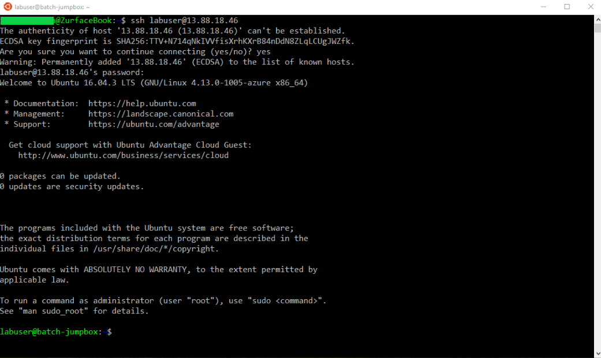
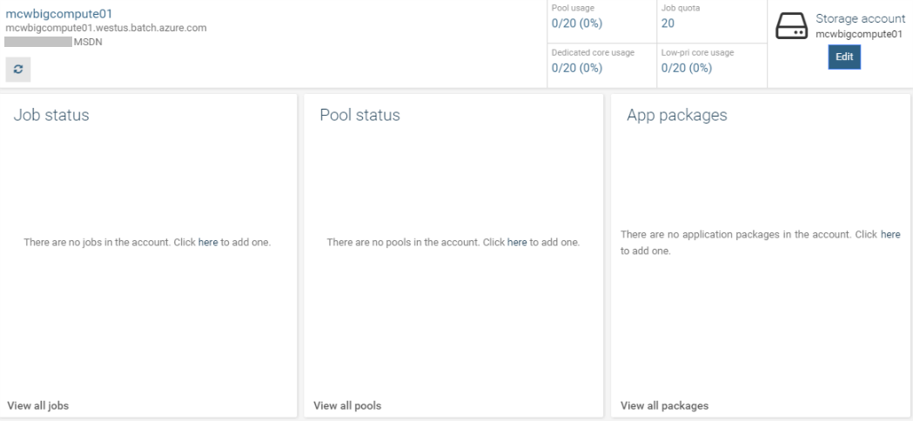
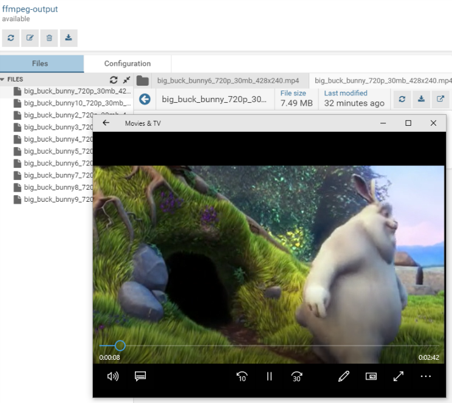
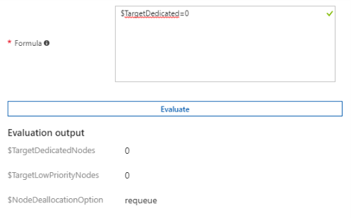
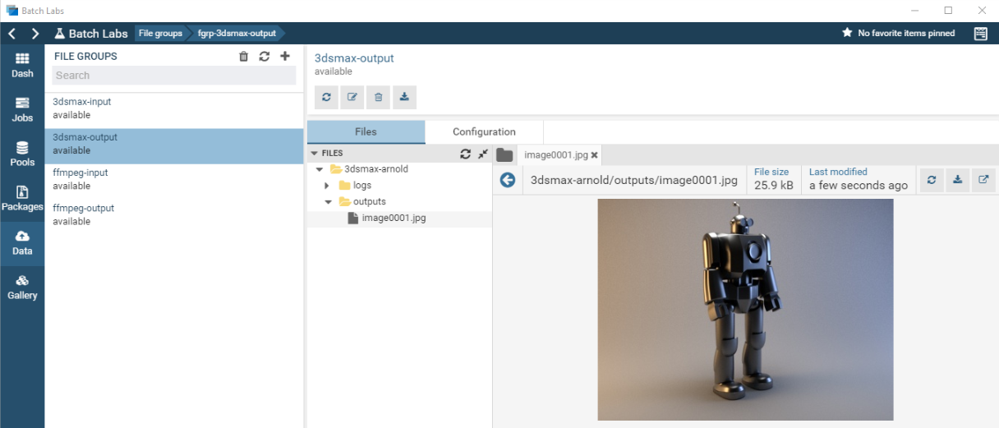

<div class="MCWHeader1">
Big Compute
</div>

<div class="MCWHeader2">
Hands-on lab unguided
</div>

<div class="MCWHeader3">
March 2018
</div>

Information in this document, including URL and other Internet Web site references, is subject to change without notice. Unless otherwise noted, the example companies, organizations, products, domain names, e-mail addresses, logos, people, places, and events depicted herein are fictitious, and no association with any real company, organization, product, domain name, e-mail address, logo, person, place or event is intended or should be inferred. Complying with all applicable copyright laws is the responsibility of the user. Without limiting the rights under copyright, no part of this document may be reproduced, stored in or introduced into a retrieval system, or transmitted in any form or by any means (electronic, mechanical, photocopying, recording, or otherwise), or for any purpose, without the express written permission of Microsoft Corporation.

Microsoft may have patents, patent applications, trademarks, copyrights, or other intellectual property rights covering subject matter in this document. Except as expressly provided in any written license agreement from Microsoft, the furnishing of this document does not give you any license to these patents, trademarks, copyrights, or other intellectual property.

The names of manufacturers, products, or URLs are provided for informational purposes only and Microsoft makes no representations and warranties, either expressed, implied, or statutory, regarding these manufacturers or the use of the products with any Microsoft technologies. The inclusion of a manufacturer or product does not imply endorsement of Microsoft of the manufacturer or product. Links may be provided to third party sites. Such sites are not under the control of Microsoft and Microsoft is not responsible for the contents of any linked site or any link contained in a linked site, or any changes or updates to such sites. Microsoft is not responsible for webcasting or any other form of transmission received from any linked site. Microsoft is providing these links to you only as a convenience, and the inclusion of any link does not imply endorsement of Microsoft of the site or the products contained therein.
© 2018 Microsoft Corporation. All rights reserved.

Microsoft and the trademarks listed at https://www.microsoft.com/en-us/legal/intellectualproperty/Trademarks/Usage/General.aspx are trademarks of the Microsoft group of companies. All other trademarks are property of their respective owners.

**Contents**

<!-- TOC -->

- [Big Compute hands-on lab unguided](#big-compute-hands-on-lab-unguided)
    - [Abstract and learning objectives](#abstract-and-learning-objectives)
    - [Overview](#overview)
    - [Solution Architecture](#solution-architecture)
    - [Requirements](#requirements)
    - [Exercise 1: Provision the Batch environment](#exercise-1-provision-the-batch-environment)
        - [Task 1: Setup a Linux jump box](#task-1-setup-a-linux-jump-box)
            - [Tasks to complete](#tasks-to-complete)
            - [Exit criteria](#exit-criteria)
        - [Task 2: Install the Azure CLI and Azure Batch extensions](#task-2-install-the-azure-cli-and-azure-batch-extensions)
            - [Tasks to complete](#tasks-to-complete-1)
            - [Exit criteria](#exit-criteria-1)
        - [Task 3: Provision Azure Batch](#task-3-provision-azure-batch)
            - [Tasks to complete](#tasks-to-complete-2)
            - [Tasks to complete](#tasks-to-complete-3)
    - [Exercise 2: Create Batch CLI templates and files](#exercise-2-create-batch-cli-templates-and-files)
        - [Task 1: Connect to Azure Batch with Batch Labs](#task-1-connect-to-azure-batch-with-batch-labs)
            - [Tasks to complete](#tasks-to-complete-4)
            - [Exit criteria](#exit-criteria-2)
        - [Task 2: Stage the sample videos to process](#task-2-stage-the-sample-videos-to-process)
            - [Tasks to complete](#tasks-to-complete-5)
            - [Exit criteria](#exit-criteria-3)
        - [Task 3: Verify video uploads](#task-3-verify-video-uploads)
            - [Tasks to complete](#tasks-to-complete-6)
            - [Exit criteria](#exit-criteria-4)
        - [Task 4: Create an Azure Batch pool template](#task-4-create-an-azure-batch-pool-template)
            - [Tasks to complete](#tasks-to-complete-7)
            - [Exit criteria](#exit-criteria-5)
        - [Task 5: Create an Azure Batch job template](#task-5-create-an-azure-batch-job-template)
            - [Tasks to complete](#tasks-to-complete-8)
            - [Exit criteria](#exit-criteria-6)
    - [Exercise 3: Run a Batch job](#exercise-3-run-a-batch-job)
        - [Task 1: Create a Pool using the Azure Batch pool template](#task-1-create-a-pool-using-the-azure-batch-pool-template)
            - [Tasks to complete](#tasks-to-complete-9)
            - [Exit criteria](#exit-criteria-7)
        - [Task 2: Create and run a job using the Azure Batch job template](#task-2-create-and-run-a-job-using-the-azure-batch-job-template)
            - [Tasks to complete](#tasks-to-complete-10)
            - [Exit criteria](#exit-criteria-8)
    - [Exercise 4: Scale a pool](#exercise-4-scale-a-pool)
        - [Task 1: Enable Autoscale on the pool](#task-1-enable-autoscale-on-the-pool)
            - [Tasks to complete](#tasks-to-complete-11)
            - [Exit criteria](#exit-criteria-9)
        - [Task 2: Apply an Autoscale formula](#task-2-apply-an-autoscale-formula)
            - [Tasks to complete](#tasks-to-complete-12)
            - [Exit criteria](#exit-criteria-10)
        - [Task 3: Trigger and observe Autoscale](#task-3-trigger-and-observe-autoscale)
            - [Tasks to complete](#tasks-to-complete-13)
            - [Exit criteria](#exit-criteria-11)
    - [Exercise 5: 3D Rendering with the Batch Rendering Service](#exercise-5-3d-rendering-with-the-batch-rendering-service)
        - [Task 1: Create the file groups](#task-1-create-the-file-groups)
            - [Tasks to complete](#tasks-to-complete-14)
            - [Exit criteria](#exit-criteria-12)
        - [Task 2: Render a 3ds Max scene](#task-2-render-a-3ds-max-scene)
            - [Tasks to complete](#tasks-to-complete-15)
            - [Exit criteria](#exit-criteria-13)
    - [After the hands-on lab](#after-the-hands-on-lab)
        - [Task 1: Cleanup the lab resource group](#task-1-cleanup-the-lab-resource-group)

<!-- /TOC -->

# Big Compute hands-on lab unguided 

## Abstract and learning objectives 

Setup and configure a scale-out media processing architecture using Azure Batch. You will use big compute (scale-out compute, embarrassingly parallel processing) techniques without having to write a lot of code, learning how these tasks can be accomplished declaratively.

Learning Objectives:

-   Learn the core capabilities of Azure Batch

-   Understand how to author custom Pool and Job templates

-   Work with Job input and output files

-   Learn to author Batch auto-scale formulas

-   Leverage Batch Labs and the Azure Portal for management and monitoring

-   Use Marketplace applications to simplify common big compute tasks, such as 3D rendering

## Overview

The Big Compute hands-on lab will enable you to understand how to implement big compute workloads targeted at 3D rendering and media processing in Azure using Azure Batch and Azure Storage.

## Solution Architecture

Below is a diagram of the solution architecture you will build in this lab. Please study this carefully, so you understand the whole of the solution as you are working on the various components.


In this lab, you deploy Azure Batch and an Azure Batch Pool consisting of Linux Virtual Machines. The Pool of VMs is configured to run the FFmpeg app to process videos across the VM nodes in the pool. This is done using Batch templates and files, which enable you to perform scale-out execution of command line executables (in this case FFmpeg) without having to write any code. You can use Azure Batch Labs or the Azure CLI to manage and monitor jobs executing in the Pool.

## Requirements

-   Microsoft Azure subscription (non-Microsoft subscription)

-   A local machine running Windows or Mac OS X

## Exercise 1: Provision the Batch environment

Duration: 30 minutes

In this exercise, you will set up your environment to work with Azure Batch.

### Task 1: Setup a Linux jump box 

#### Tasks to complete

1.  Provision an Ubuntu Server 16.04 LTS virtual machine in Azure

    -   Use the Resource Group name "**mcw-lab-big-compute**"

    -   Select a size of **D1 Standard**

#### Exit criteria

-   You can SSH into the deployed VM\
    

### Task 2: Install the Azure CLI and Azure Batch extensions

#### Tasks to complete

1.  Within the SSH session to the VM, install the Azure CLI

2.  Within your SSH session, run the following command to prepare for the CLI:
    ```
    echo "deb [arch=amd64] https://packages.microsoft.com/repos/azure-cli/ wheezy main" | \
         sudo tee /etc/apt/sources.list.d/azure-cli.list
    ```

3.  Next, run the following commands to install the Azure CLI:
    ```
    sudo apt-key adv --keyserver packages.microsoft.com --recv-keys 52E16F86FEE04B979B07E28DB02C46DF417A0893

    sudo apt-get install apt-transport-https

    sudo apt-get update && sudo apt-get install azure-cli
    ```

4.  Install the Microsoft Azure Batch Extensions:
    ```
    az extension add --source 
    ```

    https://github.com/Azure/azure-batch-cli-extensions/releases/download/azure-batch-cli-extensions-2.1.0/azure\_batch\_cli\_extensions-2.1.0-py2.py3-none-any.whl

#### Exit criteria

-   Verify if the extension was installed by running:
    ```
    az extension list
    ```

-   If you see output similar to the following, the extension is properly installed:
    ```
    [
      {
        "extensionType": "whl",
        "name": "azure-batch-cli-extensions",
        "version": "2.1.0"
      }
    ]
    ```

### Task 3: Provision Azure Batch

#### Tasks to complete

1.  Provision an instance of the Batch Service

    -   Use the Resource Group mcw-lab-big-compute

    -   Use a Pool allocation mode of Batch service

#### Tasks to complete

-   The Batch Service is deployed

## Exercise 2: Create Batch CLI templates and files

Duration: 60 minutes

In this exercise, you will resample video files in scale-out way by using Azure Batch. While there are multiple ways to accomplish this in Azure Batch, in this exercise, you will use Batch templates and files, which enable you to perform scale-out execution of command line executables (in this case FFmpeg) without having to write any code.

### Task 1: Connect to Azure Batch with Batch Labs 

#### Tasks to complete

1.  Launch Batch Labs and connect to your Azure Subscription

#### Exit criteria

-   You can see the Batch Account you created using the Dashboard in Batch Labs\
    

### Task 2: Stage the sample videos to process

#### Tasks to complete

1.  Preview the video you will process by navigating to: <http://sample-videos.com/video/mp4/720/big_buck_bunny_720p_30mb.mp4>

2.  In your SSH session to the Jump Box:

    -   Create a directory called **samples**

    -   Download the aforementioned video

    -   Make 9 additional copies of the video in the same directory

    -   Log in and select your Azure Subscription using the Azure CLI

    -   Log in to your Batch Account by executing the following command (be sure to replace the batchAccountName with the name of your Batch Account):\
        sudo az batch account login -g mcw-lab-big-compute -n **batchAccountName\

    -   Copy the video files from your Jump Box to the linked Storage Account by using the following command from the Batch:\
        sudo az batch file upload \--local-path . \--file-group ffmpeg-input \--account-name **batchAccountName** \--account-endpoint **batchAccountName**.**location**.batch.azure.com

#### Exit criteria

-   The upload command completed without error

### Task 3: Verify video uploads 

#### Tasks to complete

1.  Launch **Storage Explorer**

2.  Connect to your Azure Subscription

3.  Navigate to the Storage container into which your videos were uploaded

#### Exit criteria

-   Using Storage Explorer, you can see the 10 videos that were uploaded:\
    

### Task 4: Create an Azure Batch pool template 

An Azure Batch Pool Template enables an experienced Batch user to provide a simplified approach for less experienced Batch users or applications to create a Batch Pool, exposing of the configuration only the parameters the end user or application is truly concerned about. In this task, you will create a Pool Template that creates a Batch Pool which will automatically download and install the ffmpeg utility to each node in the Pool using the apt package manager included with Ubuntu Linux. By defining the Pool in this way, you avoid having to write any script code that would have to run on each node at start-up in order to install ffmpeg---the configuration of each node is effectively performed declaratively.

#### Tasks to complete

1.  Use the nano editor in the SSH session to create a file called **pool.json**

2.  Begin by creating an empty document with the following three lines:
    ```
    {

    }
    ```

3.  Then add the parameter definition by pasting the following JSON in the second line between the open and closed curly brace:
    ```
        "parameters": {
            "nodeCount": {
                "type": "int",
                "metadata": {
                    "description": "The number of pool nodes"
                }
            },
            "poolId": {
                "type": "string",
                "metadata": {
                    "description": "The pool id "
                }
            }
        },
    ```

4.  Next in the line below the JSON you just added (just below the "}," add the following template body:
    ```
        "pool": {
            "type": "Microsoft.Batch/batchAccounts/pools",
            "apiVersion": "2016-12-01",
            "properties": {
                "id": "[parameters('poolId')]",
                "virtualMachineConfiguration": {
                    "imageReference": {
                        "publisher": "Canonical",
                        "offer": "UbuntuServer",
                        "sku": "16.04.0-LTS",
                        "version": "latest"
                    },
                    "nodeAgentSKUId": "batch.node.ubuntu 16.04"
                },
                "vmSize": "STANDARD_D3_V2",
                "targetDedicatedNodes": "[parameters('nodeCount')]",
                "enableAutoScale": false,
                "maxTasksPerNode": 1,
                "packageReferences": [
                    {
                        "type": "SPECIFY_PACKAGE_MANAGER",
                        "id": "SPECIFY_PACKAGE"
                    }
                ]
            }
        }
    ```

5.  Modify the packageReferences to use the aptPackage package manager to install the FFmpeg package

6.  Save the file and exit nano

#### Exit criteria

-   You have created the pool.json template

### Task 5: Create an Azure Batch job template 

The first step in building a Batch Job is understanding the command line of the tool you want to execute when the task runs. In this case we want to run FFmpeg. In this task, you will become familiar with the command line for FFmpeg and then you will create a Job template that describes to Azure Batch how to invoke FFmpeg to resample each of the videos that were uploaded.

#### Tasks to complete

1.  Return to your SSH session

2.  Within the SSH session use apt-get to install the FFmpeg package

3.  Run FFmpeg against one of the MP4 files to resample it to a size of 428x240, using a command similar to:
    ```
    ffmpeg -i big_buck_bunny_720p_30mb.mp4 -y -s "428x240" -strict -2 output.mp4
    ```

4.  Verify the new MP4 file was created and that it is smaller than the original in size

5.  Use the nano editor to create job.json

6.  Copy and paste the following complete job template:
    ```
    {
        "parameters": {
            "poolId": {
                "type": "string",
                "metadata": {
                    "description": "The name of Azure Batch pool which runs the job"
                }
            },
            "jobId": {
                "type": "string",
                "metadata": {
                    "description": "The name of Azure Batch job"
                }
            },
            "resolution": {
                "type": "string",sudo
                "defaultValue": "428x240",
                "allowedValues": [
                    "428x240",
                    "854x480"
                ],
                "metadata": {
                    "description": "Target video resolution"
                }
            }
        },
        "job": {
            "type": "Microsoft.Batch/batchAccounts/jobs",
            "apiVersion": "2016-12-01",
            "properties": {
                "id": "[parameters('jobId')]",
                "constraints": {
                    "maxWallClockTime": "PT5H",
                    "maxTaskRetryCount": 1
                },
                "poolInfo": {
                    "poolId": "[parameters('poolId')]"
                },
                "taskFactory": {
                    "type": "taskPerFile",
                    "source": { 
                        "fileGroup": "ffmpeg-input"
                    },
                    "repeatTask": {
                        "commandLine": "ffmpeg -i {fileName} -y -s [parameters('resolution')] -strict -2 {fileNameWithoutExtension}_[parameters('resolution')].mp4",
                        "resourceFiles": [
                            {
                                "blobSource": "{url}",
                                "filePath": "{fileName}"
                            }
                        ],
                        "outputFiles": [
                            {
                                "filePattern": "{fileNameWithoutExtension}_[parameters('resolution')].mp4",
                                "destination": {
                                    "autoStorage": {
                                        "path": "{fileNameWithoutExtension}_[parameters('resolution')].mp4",
                                        "fileGroup": "ffmpeg-output"
                                    }
                                },
                                "uploadOptions": {
                                    "uploadCondition": "TaskSuccess"
                                }
                            }
                        ]
                    }
                },
                "onAllTasksComplete": "terminatejob"
            }
        }
    }
    ```

7.  Save the file and exit nano.

#### Exit criteria

-   You have created the job.json template.

## Exercise 3: Run a Batch job

Duration: 30 minutes

In this exercise you will provision the Batch Pool and use it to execute the resampling job that you defined previously.

### Task 1: Create a Pool using the Azure Batch pool template 

In this task, pretend you are switching roles and are now the end user who has been handed the template to create a Pool designed for running ffmpeg jobs.

#### Tasks to complete

1.  Return to your SSH session

2.  Run the following command to create a new Batch Pool from the template:
    
    sudo az batch pool create \--template pool.json \--account-name **batchAccountName** \--account-endpoint **batchAccountName**.**batchAccountLocation**.batch.azure.com

3.  Provide a poolId of resamplePool and a nodeCount of 5

#### Exit criteria

-   Using Batch Labs, you can see your new pool has 5 instances\
    

### Task 2: Create and run a job using the Azure Batch job template 

In this task, you will continue in the role of the end user, this time using the Job Template that was supplied for running ffmpeg.

#### Tasks to complete

1.  From your SSH session, Run the following command to create and run the job to resample the images:\
    sudo az batch job create \--template job.json \--account-name **batchAccountName** \--account-endpoint **batchAccountName**.**batchAccountLocation**.batch.azure.com

2.  Provide the appropriate parameters to target your Pool and provide the name of firstResample for the jobId

3.  Using Batch Labs monitor the Job using the Dashboard

4.  When the job has completed use Batch Labs to:

-   View the Job Statistics and analyze the Tasks running time

-   View the Job Statistics and analyze the Job progress

-   Use the Jobs tab to select a single Job and view the contents of its working directory (wd)

-   Use the Data tab to select the ffmpeg-output file group and open one of the resampled output videos

#### Exit criteria

-   You can watch the resampled video on your local computer\
    

    (c) copyright 2008, Blender Foundation / www.bigbuckbunny.org

## Exercise 4: Scale a pool

Duration: 45 minutes

In this exercise you will configure the resamplePool so that it starts with zero nodes. You will define an Autoscale Formula that will automatically scale up the number of nodes in the pool when there are tasks to process. When all tasks have completed, the pools will scale back down to zero nodes in the pool.

### Task 1: Enable Autoscale on the pool

#### Tasks to complete

1.  Use the Azure Portal to navigate to your Batch Account

2.  For the Pool, change the mode to **Auto Scale**

3.  Save the change providing only a minimal scaling formula

4.  Evaluate the formula you entered

#### Exit criteria

-   Autoscale is enabled for the Pool and you are able to see the evaluation results

    

### Task 2: Apply an Autoscale formula

We had to enable Auto scale using the portal, but we can also edit the Auto scale formula using Batch Labs. In this Task we will use Batch Labs to configure the Auto scale.

#### Tasks to complete

1.  Return to Batch Labs

2.  Use the **Pools** tab to select your Pool to view the Pool details

3.  Launch the Resize Pool dialog

4.  Within the Resize Pool Dialog, set the Evaluation interval to **5** minutes and provide the following scaling formula:
    ```
    //This formula assumes you have set the Evaluation Interval on the Pool to 5 minutes.

    // Get pending tasks for the past 5 minutes.
    $samples = $ActiveTasks.GetSamplePercent(TimeInterval_Minute * 5);

    // If we have fewer than 70 percent data points, we use the last sample point, otherwise we use the maximum of last sample point and the history average.
    $tasks = $samples < 70 ? max(0, $ActiveTasks.GetSample(1)) : max( $ActiveTasks.GetSample(1), avg($ActiveTasks.GetSample(TimeInterval_Minute * 5)));

    // If number of pending tasks is not 0, set targetVMs to pending tasks, otherwise half of current dedicated.
    $targetVMs = $tasks > 0 ? $tasks : max(0, $TargetDedicated / 4);

    // The pool size is capped at 4, if target VM value is more than that, set it to 4. 
    cappedPoolSize = 4;
    $TargetDedicated = max(0, min($targetVMs, cappedPoolSize));

    // Set node deallocation mode - keep nodes active only until tasks finish
    $NodeDeallocationOption = taskcompletion;
    ```

5.  Save the settings

#### Exit criteria

-   Verify that the Formula was applied, by selecting the Resize button again

-   If the settings were not successfully saved (because Batch Labs is still in Beta), use the Azure Portal to apply the Auto scale evaluation interval and formula

    

### Task 3: Trigger and observe Autoscale

#### Tasks to complete

1.  Return to your SSH session

2.  Submit another job using the template you created previously, call this job "scalingResampletest"

3.  Switch over to Batch Labs and monitor the Pool nodes as they are provisioned, change state and are de-provisioned. Wait for the Job to complete and all nodes to be de-provisioned

#### Exit criteria

-   You witnessed a Batch Pool scale up from 0 nodes, to 4 nodes, process the queued tasks and then gradually scale back down to 0 nodes

## Exercise 5: 3D Rendering with the Batch Rendering Service

Duration: 45 minutes

In this exercise, you will use the Azure Batch Rendering Service to render a frame from a 3D animation program used in industry that is called 3D Studio Max. The Batch Rendering Service coupled with the Batch Labs application means you don't have to write any code to render using a render farm provided by Azure Batch.

### Task 1: Create the file groups

#### Tasks to complete

1.  Download the sample 3ds Max scene from: <https://support.solidangle.com/download/attachments/40665256/Introduction-to-Arnold_robot_final.zip?version=1&modificationDate=1490281794000&api=v2>

2.  Extract it into a folder called **scen**.

3.  Use Batch Labs to create a new File Group:

-   File group name: **specify 3dsmax-input**

-   Files: Use the **select directory** button to navigate to the **Scene** directory and select it

-   File Options: leave these at the default values

4.  Create another empty File Group called **3dsmax-output**

#### Exit criteria

-   On the Data tab of Batch Labs you can see your two File Groups

### Task 2: Render a 3ds Max scene

#### Tasks to complete

1.  Use the 3ds Max application in the Batch Labs Gallery to render an Arnold Scene

2.  Run the job with an auto pool

-   Name the pool **3dsmax-Pool**

-   Use a single, Standard\_D2\_V2 VM

3.  Configure the job to use the name **3dsmax-arnold** and to use the input File Group you created, referring to the .max file you uploaded. Render only the first frame at **400x300**

4.  Specify the output filegroup

5.  Submit the job

6.  Monitor the Pool status and observe the lifecycle of the node as the render happens

#### Exit criteria

-   When the job is complete, view the output rendered image. It should look similar to the following:\
    

-   Verify that the Job is terminating, and the Pool is deleting

## After the hands-on lab 

Duration: 10 minutes

Before you conclude the lab, you should make sure to clean up all the resources used by the lab.

### Task 1: Cleanup the lab resource group

1.  Navigate to the Azure Portal and locate the Resource Group you created for this lab (**mcw-lab-big-compute**)

2.  Select **Delete resource group** from the command bar\
    

3.  In the confirmation dialog that appears, enter the name of the resource group and select **Delete**\
    

4.  Wait for the confirmation that the Resource Group has been successfully deleted. If you don't wait, and the delete fails for some reason, you may be left with resources running that were not expected. You can monitor using the Notifications dialog, accessible from the Alarm icon.\
    

5.  When the Notification indicates success, the cleanup is complete\
    

You should follow all steps provided *after* attending the Hands-on lab.